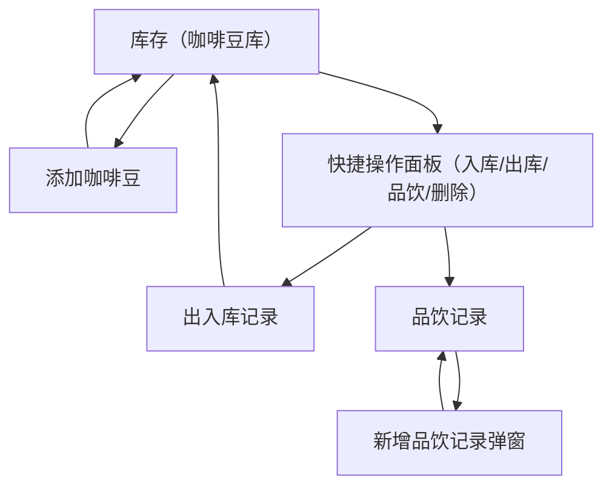

## 1. Product Overview

一款用于个人记录咖啡豆库存、出入库与品饮记录的轻量应用。\
通过清晰的信息层级与更可访问的交互，降低记录成本、减少误操作。

## 2. Core Features

### 2.1 User Roles

本产品为本地单人使用（无账号体系）。

### 2.2 Feature Module

本应用由以下页面构成：

1. **库存（咖啡豆库）**：库存概览、咖啡豆列表、快捷出入库/品饮/删除。
2. **添加咖啡豆**：基础信息录入、表单校验、保存反馈。
3. **出入库记录**：记录列表、按时间倒序、颜色区分入/出库。
4. **品饮记录**：按豆筛选的记录列表、新增记录弹窗表单。

### 2.3 Page Details

| Page Name | Module Name           | Feature description                                                            |
| --------- | --------------------- | ------------------------------------------------------------------------------ |
| 库存（咖啡豆库）  | 顶部信息层级                | 展示“我的咖啡豆库”标题与主行动按钮“新增豆子”；在标题下增加轻量概览（豆子数量、总库存克重）以强化页面主任务。                       |
| 库存（咖啡豆库）  | 列表与卡片排版               | 以卡片列表展示咖啡豆：名称（一级）、产地/烘焙度（次级）、库存克重（强调）；空状态文案指向主行动。                              |
| 库存（咖啡豆库）  | 快捷操作（替代纯 ActionSheet） | 点击卡片后展示“底部操作面板/操作区”（入库/出库/品饮记录/删除），对高频动作提供清晰按钮与危险操作二次确认。                       |
| 添加咖啡豆     | 表单信息层级                | 按“必填→选填”排列：名称（必填）> 产地 > 烘焙程度 > 处理方式（含“其他”自定义）> 初始重量 > 备注。                      |
| 添加咖啡豆     | 校验与可访问性反馈             | 对必填、数字输入给出明确错误提示（不只 Toast）；为输入框提供可点击的 label 与错误状态样式；保存按钮提供 loading/禁用状态避免重复提交。 |
| 出入库记录     | 列表信息密度                | 记录卡片展示：豆名（一级）、时间（次级）、入/出库数量（强调）；颜色区分 IN/OUT，同时保留符号 +/− 以兼顾色弱用户。                |
| 品饮记录      | 页面状态与导航               | 当从库存页进入时，在页头明确“品饮: 豆名”；当无选中豆时显示“所有品饮记录”，并提供“选择豆子”入口以避免隐式筛选。                    |
| 品饮记录      | 新增记录弹窗（表单排版）          | 弹窗内表单采用分组与一致的输入高度；评分使用 slider 并显示当前值；保存/取消固定在底部，内容区可滚动。                        |
| 全局        | 可访问性与一致性规范            | 统一按钮尺寸与触达面积（≥44px）；文字对比度达标（主文字/按钮文字清晰可读）；为弹窗提供清晰标题、关闭方式与焦点顺序；统一间距体系与字体层级。      |

## 3. Core Process

- 库存管理流：进入“库存”→ 点击“新增豆子”完成添加 → 在库存列表中选择豆子 → 进行入库/出库并自动写入“出入库记录”。
- 品饮记录流：在库存页选择某豆 → 进入“品饮记录”（自动按豆筛选）→ 点击“添加记录”填写并保存 → 回到列表查看最新记录。
- 记录查看流：进入“出入库记录”查看历史入/出库；进入“品饮记录”查看所有或单豆记录。

 

# 4. Coding Record

### \*\*Dollar Usage | \*\*2016-3-16 11:20 -> 11:40

TRAE Pro plan Free Tial

**Basic:$8.54->$9.05（After ReDeploy）**
