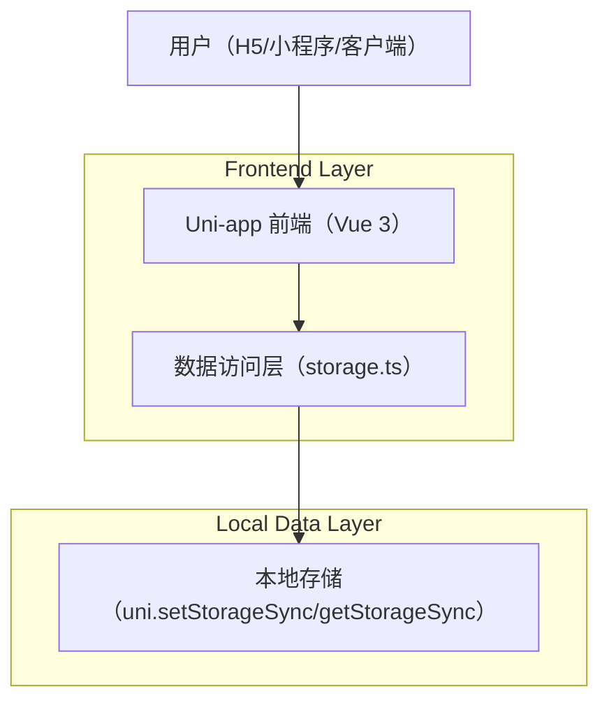

## 1.Architecture design

## 2.Technology Description
- Frontend: Vue@3 + @dcloudio/uni-app@3 + TypeScript + vite@4
- Backend: None（纯前端本地存储）

## 3.Route definitions
| Route | Purpose |
|---|---|
| /pages/index/index | 库存主页：咖啡豆列表、快捷入/出库与跳转品饮 |
| /pages/beans/add | 添加咖啡豆表单 |
| /pages/inventory/log | 出入库记录列表 |
| /pages/tasting/record | 品饮记录列表与新增弹窗 |

## 6.Data model(if applicable)
### 6.1 Data model definition
- CoffeeBean：咖啡豆基础信息与库存克重
- InventoryLog：入库/出库流水（beanId 逻辑关联 CoffeeBean.id）
- TastingRecord：品饮记录（beanId 逻辑关联 CoffeeBean.id）

（当前不使用数据库与外键约束，数据以 Key-Value 形式存储于本地。）
